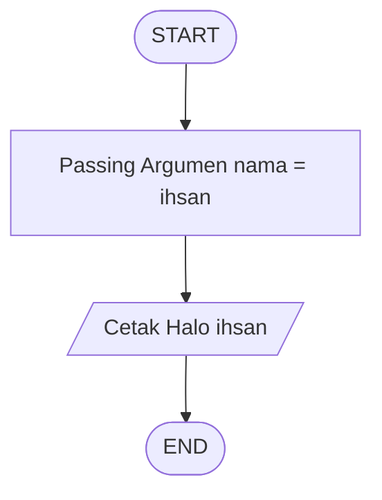
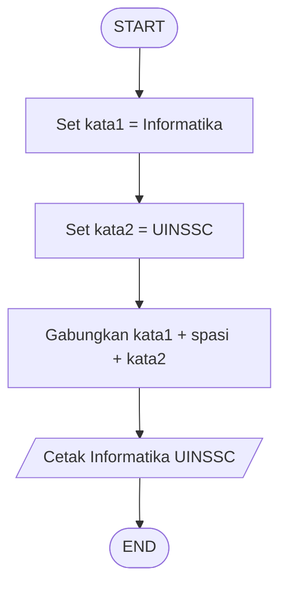
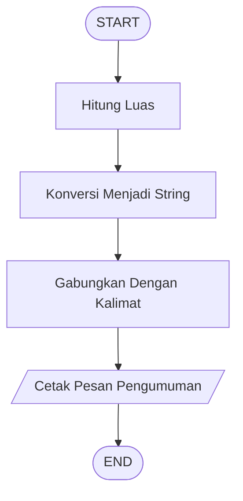
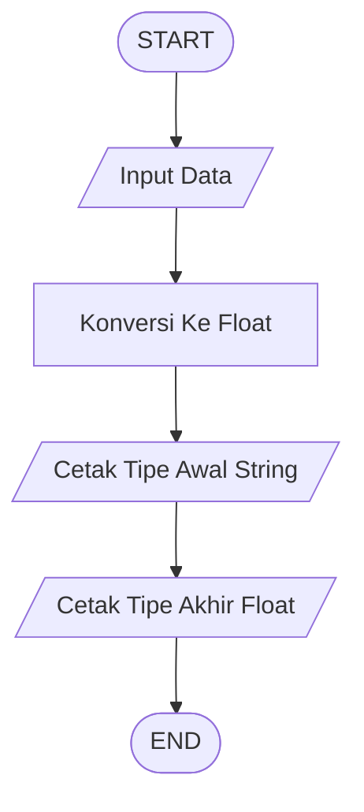
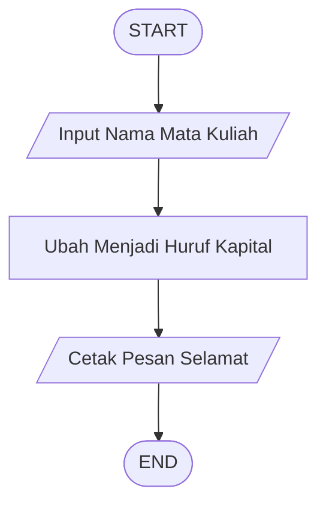
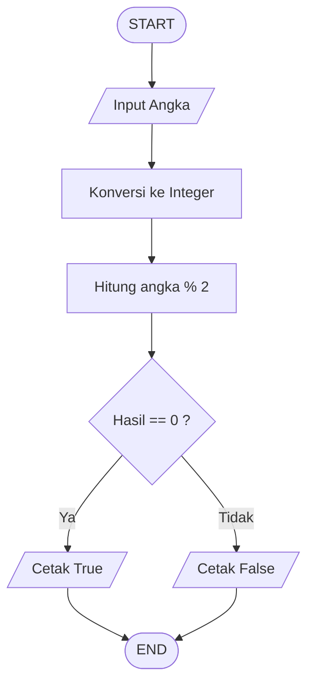

# Flowchart Praktikum Python Literals & Operators

## Soal 1 - Membuat Fungsi Input dan Menampilkan ke Konsol

---

## Soal 2 - Membuat Fungsi Input dengan Argumen

---

## Soal 3 - Memahami Hasil dari Fungsi Input

---

## Soal 4 - Mengkonversi Tipe Data Float

---

## Soal 5 - Menghitung Sisi Miring Segitiga Dengan Variabel

---

## Soal 6 - Menghitung Sisi Miring Segitiga Tanpa Variabel

## Soal 7 - Operator Konkatenasi

---

## Soal 8 - Operator Replikasi

---

## Soal 9 - Konversi ke String

---

## Soal 10 - Melihat Tipe Data dari Variabel

---

## Soal 11 - Kuis 7 Menu Pembatas

---

## Soal 12 - Kuis 8 String Method Upper

## Soal 13 - Kuis 9 Cek Bilangan Genap

