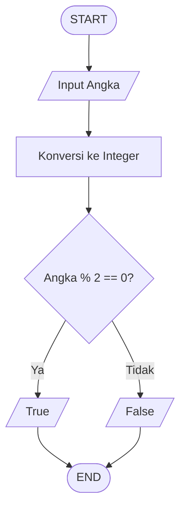

```mermaid
flowchart TD
    A([START])
    B[/Input Angka/]
    C[Konversi ke Integer]
    D{Angka % 2 == 0?}
    E[/True/]
    F[/False/]
    G([END])

    A --> B
    B --> C
    C --> D
    D -- Ya --> E
    D -- Tidak --> F
    E --> G
    F --> G
```
