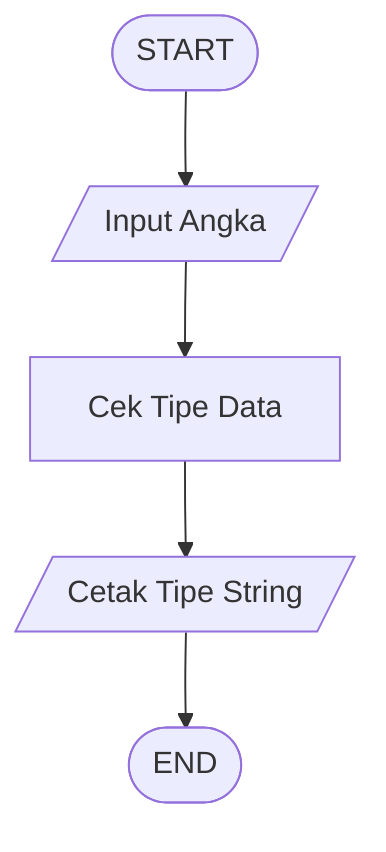
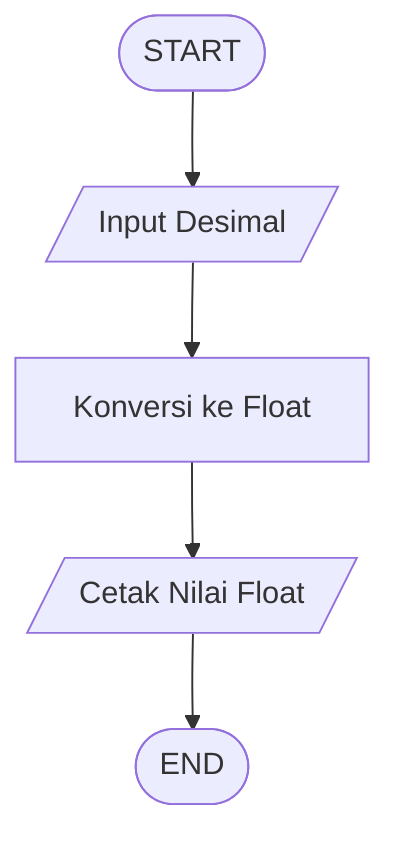
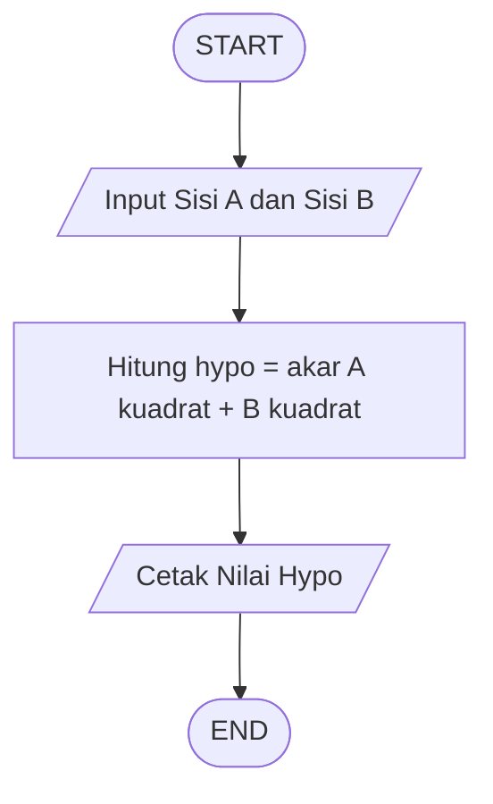
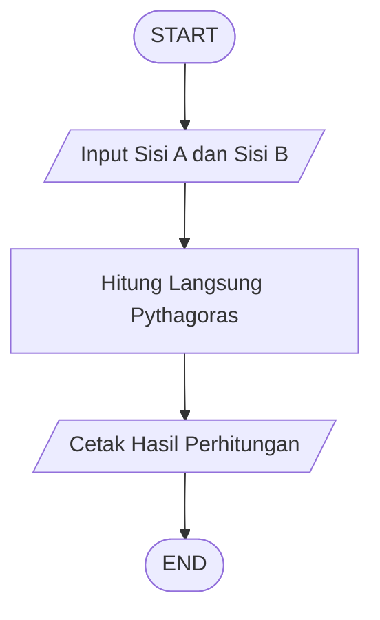

# Flowchart Praktikum Python 

([START]) dan ([END]) = Terminator
[Proses] = Process
[/Input atau Output/] = Input/Output
{Kondisi} = Decision
((O)) = Connector

# Pertemuan 4

## Soal 1 - Membuat Fungsi Input dan Menampilkan ke Konsol


---

## Soal 2 - Membuat Fungsi Input dengan Argumen


---

## Soal 3 - Memahami Hasil dari Fungsi Input



---

## Soal 4 - Mengkonversi Tipe Data Float



---

## Soal 5 - Menghitung Sisi Miring Segitiga Dengan Variabel



---

## Soal 6 - Menghitung Sisi Miring Segitiga Tanpa Variabel




## Soal 7 - Operator Konkatenasi


---

## Soal 8 - Operator Replikasi


---

## Soal 9 - Konversi ke String


---

## Soal 10 - Melihat Tipe Data dari Variabel


---

## Soal 11 - Kuis 7 Menu Pembatas


---

## Soal 12 - Kuis 8 String Method Upper


## Soal 13 - Kuis 9 Cek Bilangan Genap


#--------------------------------------------#
# Pertemuan 5
#--------------------------------------------#

# Soal 1 - Comparison Operator


---

# Soal 2 - Kuis 11 Cek KKM


---

# Soal 3 - Conditional Statement If Tunggal


---

# Soal 4 - Conditional Statement Rangkaian If Mandiri


---

# Soal 5 - Conditional Statement If Else


---

# Soal 6 - Conditional Statement If Elif Else


---

# Soal 7 - Membandingkan Dua Angka Input


---

# Soal 8 - Kuis 12 Cek Ganjil Genap

```mermaid
flowchart TD
    A([START])
    B[/Input Angka N/]
    C[Konversi Ke Integer]
    D{Sisa Bagi Dua Sama Dengan Nol}
    E[/Angka Genap/]
    F[/Angka Ganjil/]
    G((O))
    H([END])

    A --> B --> C --> D
    D -- Ya --> E
    D -- Tidak --> F
    E --> G
    F --> G
    G --> H
```

---

# Soal 9 - Fungsi Max Dengan Variabel

```mermaid
flowchart TD
    A([START])
    B[Set Nilai Fisika Kimia Dan Biologi]
    C[Proses Fungsi Max]
    D[Simpan Ke Skor Terbaik]
    E[/Tampilkan Skor Terbaik/]
    F([END])

    A --> B --> C --> D --> E --> F
```

---

# Soal 10 - Fungsi Max Pada List

```mermaid
flowchart TD
    A([START])
    B[Set Data Kecepatan]
    C[Cari Nilai Terbesar Dalam List]
    D[/Tampilkan List Kecepatan/]
    E[/Tampilkan Nilai Maksimum/]
    F([END])

    A --> B --> C --> D --> E --> F
```

#---------------------------------#
# Pertemuan 6
#---------------------------------#

# Soal 1 - Perulangan While Contoh 1
```mermaid
flowchart TD
    A([START])
    B[Set Counter 1 dan Limit 5]
    C{Counter Kurang Sama Dengan Limit}
    D[/Tampilkan Iterasi/]
    E[Counter Ditambah 1]
    F([END])

    A --> B
    B --> C
    C -- Ya --> D
    D --> E
    E --> C
    C -- Tidak --> F
```
# Soal 2 - Perulangan While Contoh 2
```mermaid
flowchart TD
    A([START])
    B[Set Stok 5]
    C{Stok Lebih Dari Nol}
    D[/Tampilkan Sisa Stok/]
    E[Kurangi Stok Satu]
    F[/Tampilkan Stok Habis/]
    G([END])

    A --> B
    B --> C
    C -- Ya --> D
    D --> E
    E --> C
    C -- Tidak --> F
    F --> G
```
# Soal 3 - Kasus Ganjil Genap Dengan While
```mermaid
flowchart TD
    A([START])
    B[Set Limit 20 dan N 1]
    C{N Kurang Sama Dengan Limit}
    D{N Modulo 2 Sama Dengan Nol}
    E[Masukkan Ke Daftar Genap]
    F[Masukkan Ke Daftar Ganjil]
    G[N Ditambah 1]
    H[/Tampilkan Rekapitulasi/]
    I([END])

    A --> B
    B --> C
    C -- Ya --> D
    D -- Ya --> E
    D -- Tidak --> F
    E --> G
    F --> G
    G --> C
    C -- Tidak --> H
    H --> I
```
# Soal 4 - Validasi Password Dengan While
```mermaid
flowchart TD
    A([START])
    B[Password Kosong]
    C{Password Benar}
    D[/Input Password/]
    E[/Tampilkan Akses Diterima/]
    F([END])

    A --> B
    B --> C
    C -- Tidak --> D
    D --> C
    C -- Ya --> E
    E --> F
```
# Soal 5 - Perulangan For Perbandingan Karakter
```mermaid
flowchart TD
    A([START])
    B[Ambil Pasangan Karakter]
    C{Karakter Lebih Kecil}
    D[Status Lebih Kecil]
    E{Karakter Lebih Besar}
    F[Status Lebih Besar]
    G[Status Sama]
    H((O))
    I[/Tampilkan Hasil/]
    J([END])

    A --> B
    B --> C
    C -- Ya --> D
    C -- Tidak --> E
    E -- Ya --> F
    E -- Tidak --> G
    D --> H
    F --> H
    G --> H
    H --> I
    I --> B
    B --> J
```
# Soal 6 - Perulangan For Eksponensial Dua
```mermaid
flowchart TD
    A([START])
    B[Set Batas Atas dan Dictionary]
    C[/Tampilkan Header Tabel/]
    D{Ambil Nilai I}
    E[Hitung Dua Pangkat I]
    F[/Tampilkan Baris Tabel/]
    G([END])

    A --> B
    B --> C
    C --> D
    D -- Ya --> E
    E --> F
    F --> D
    D -- Tidak --> G
```
# Soal 7 - Break Dan Continue Nested Loop
```mermaid
flowchart TD
    A([START])
    B{Loop Luar}
    C{Loop Dalam}
    D{I Sama Dengan J}
    E((Continue))
    F{I Tambah J Lebih Dari Empat}
    G((Break))
    H[/Tampilkan Koordinat/]
    I([END])

    A --> B
    B -- Ya --> C
    B -- Tidak --> I

    C -- Ya --> D
    C -- Tidak --> B

    D -- Ya --> E
    E --> C

    D -- Tidak --> F

    F -- Ya --> G
    G --> B

    F -- Tidak --> H
    H --> C
```
# Soal 8 - Implementasi Break
```mermaid
flowchart TD
    A([START])
    B[Set Target 120]
    C{Ambil Nilai I}
    D{Target Habis Dibagi I}
    E[/Tampilkan Pembagi/]
    F([END])

    A --> B
    B --> C
    C -- Ya --> D
    C -- Tidak --> F
    D -- Ya --> E
    E --> F
    D -- Tidak --> C
```
# Soal 9 - Implementasi Continue
```mermaid
flowchart TD
    A([START])
    B[Set Data Transaksi]
    C{Ambil Nilai}
    D{Nilai Kurang Sama Dengan Nol}
    E((Continue))
    F[Tambahkan Ke Total]
    G[/Tampilkan Transaksi/]
    H[/Tampilkan Pendapatan Bersih/]
    I([END])

    A --> B
    B --> C
    C -- Ya --> D
    C -- Tidak --> H

    D -- Ya --> E
    E --> C

    D -- Tidak --> F
    F --> G
    G --> C

    H --> I
```
# Soal 10 - While Dengan Else
```mermaid
flowchart TD
    A([START])
    B[Set N Sama Dengan Satu]
    C{N Kurang Sama Dengan Lima}
    D[/Tampilkan Nilai N/]
    E[N Ditambah Satu]
    F[/Loop Selesai Normal/]
    G([END])

    A --> B
    B --> C
    C -- Ya --> D
    D --> E
    E --> C
    C -- Tidak --> F
    F --> G
```
# Soal 11 - For Else Cek Bilangan Prima
```mermaid
flowchart TD
    A([START])
    B{Ambil Angka}
    C{Ada Pembagi}
    D[/Bukan Prima/]
    E[/Prima/]
    F((Break))
    G([END])

    A --> B
    B -- Ya --> C
    B -- Tidak --> G

    C -- Ya --> D
    D --> F
    F --> B

    C -- Tidak --> E
    E --> B
```
# Soal 12 - Ekspresi Logika Python
```mermaid
flowchart TD
    A([START])
    B[Set Variabel Logika]
    C[Evaluasi And]
    D[Evaluasi Or]
    E[Evaluasi Not]
    F[Evaluasi Perbandingan]
    G[/Tampilkan Semua Hasil/]
    H([END])

    A --> B --> C --> D --> E --> F --> G --> H
```
# Soal 13 - Logical Dan Bitwise
```mermaid
flowchart TD
    A([START])
    B[Set A dan B]
    C[Evaluasi Logical]
    D[Evaluasi Bitwise]
    E[/Tampilkan Hasil/]
    F([END])

    A --> B --> C --> D --> E --> F
```
# Soal 14 - Binary Shifting
```mermaid
flowchart TD
    A([START])
    B[Set Angka Dua Puluh]
    C[Geser Kiri Tiga Bit]
    D[Geser Kanan Dua Bit]
    E[/Tampilkan Desimal Dan Biner/]
    F([END])

    A --> B --> C --> D --> E --> F
```
# Soal 15 - Bitwise Masking Dan Encryption
```mermaid
flowchart TD
    A([START])
    B[Set Data Sensor Masker Dan Kunci]
    C[Ambil Empat Bit Terakhir]
    D[Enkripsi Dengan Shift Dan XOR]
    E[/Tampilkan Hasil/]
    F([END])

    A --> B --> C --> D --> E --> F
```
