# Flowchart Praktikum Python 
# Pertemuan 4

## Soal 1 - Membuat Fungsi Input dan Menampilkan ke Konsol

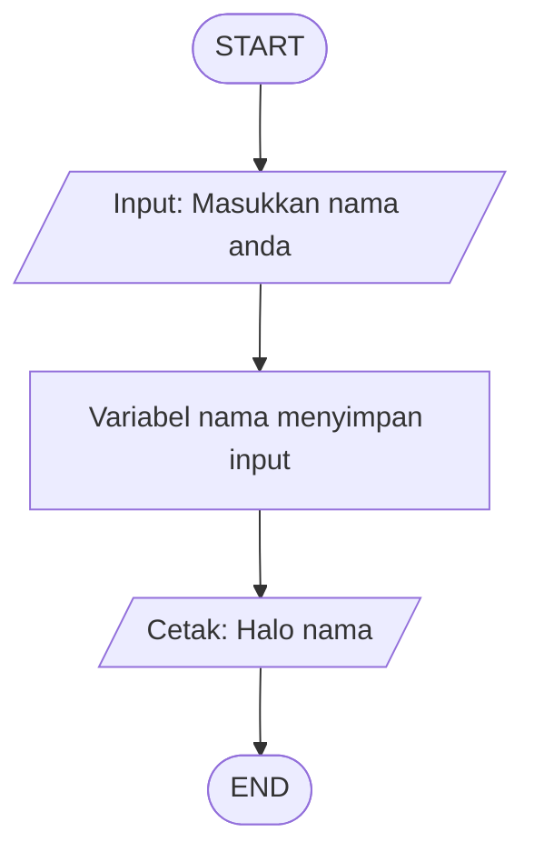

---

## Soal 2 - Membuat Fungsi Input dengan Argumen


---

## Soal 3 - Memahami Hasil dari Fungsi Input


---

## Soal 4 - Mengkonversi Tipe Data Float

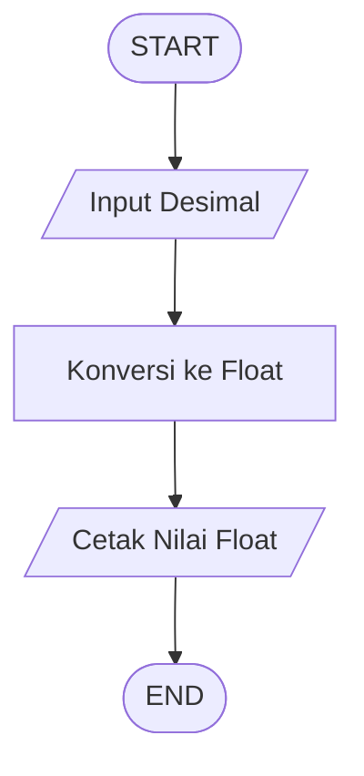

---

## Soal 5 - Menghitung Sisi Miring Segitiga Dengan Variabel


---

## Soal 6 - Menghitung Sisi Miring Segitiga Tanpa Variabel


## Soal 7 - Operator Konkatenasi


---

## Soal 8 - Operator Replikasi

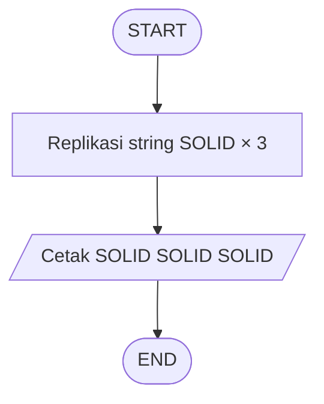

---

## Soal 9 - Konversi ke String


---

## Soal 10 - Melihat Tipe Data dari Variabel


---

## Soal 11 - Kuis 7 Menu Pembatas

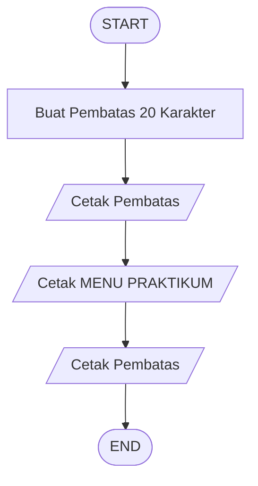

---

## Soal 12 - Kuis 8 String Method Upper


## Soal 13 - Kuis 9 Cek Bilangan Genap


#--------------------------------------------#
# Pertemuan 5
#--------------------------------------------#

# Soal 1 - Comparison Operator

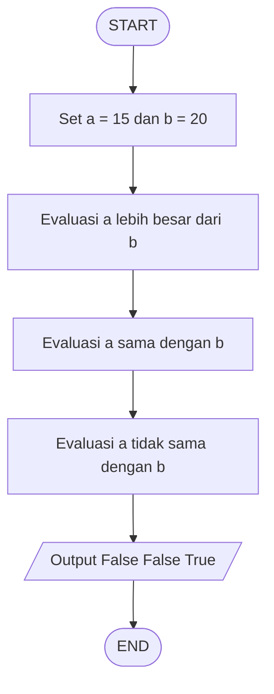

---

# Soal 2 - Kuis 11 Cek KKM

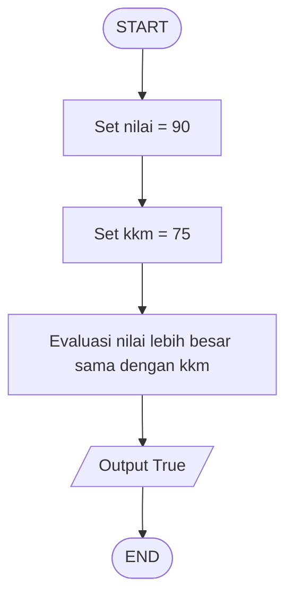

---

# Soal 3 - Conditional Statement If Tunggal

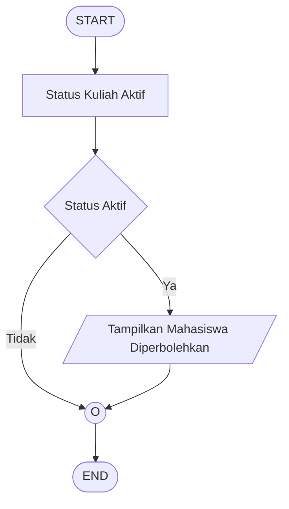

---

# Soal 4 - Conditional Statement Rangkaian If Mandiri

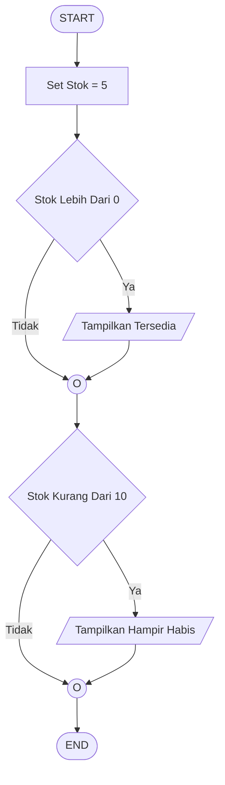

---

# Soal 5 - Conditional Statement If Else

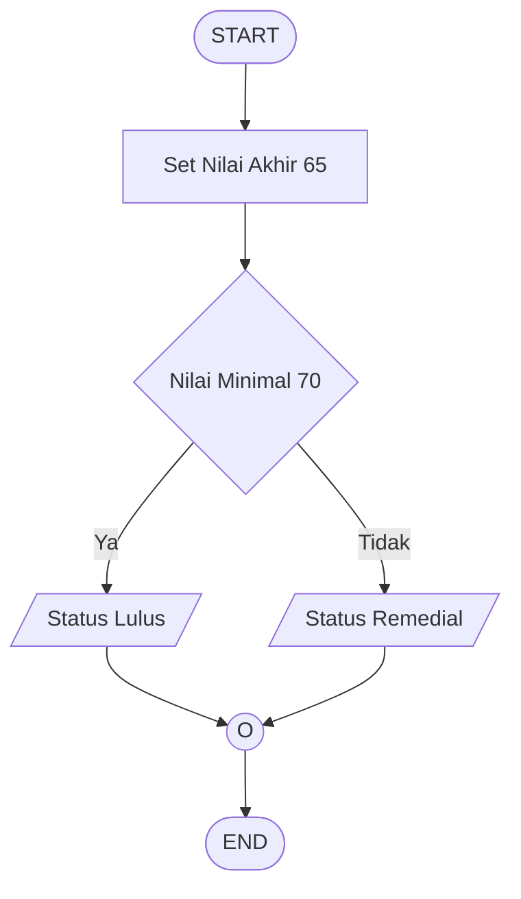

---

# Soal 6 - Conditional Statement If Elif Else

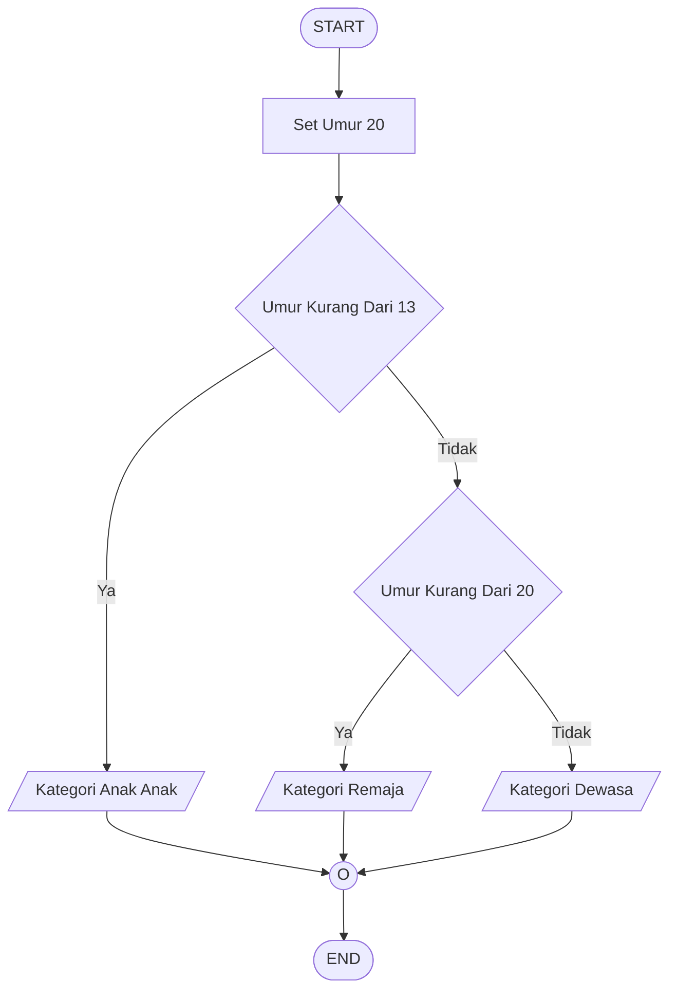

---

# Soal 7 - Membandingkan Dua Angka Input

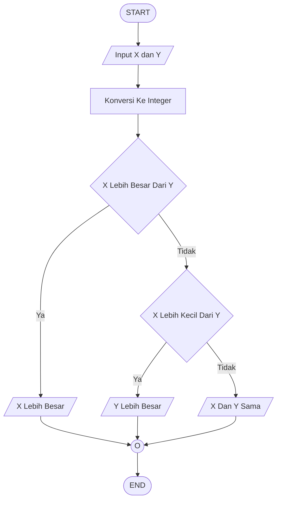

---

# Soal 8 - Kuis 12 Cek Ganjil Genap

```mermaid
flowchart TD
    A([START])
    B[/Input Angka N/]
    C[Konversi Ke Integer]
    D{Sisa Bagi Dua Sama Dengan Nol}
    E[/Angka Genap/]
    F[/Angka Ganjil/]
    G((O))
    H([END])

    A --> B --> C --> D
    D -- Ya --> E
    D -- Tidak --> F
    E --> G
    F --> G
    G --> H
```

---

# Soal 9 - Fungsi Max Dengan Variabel

```mermaid
flowchart TD
    A([START])
    B[Set Nilai Fisika Kimia Dan Biologi]
    C[Proses Fungsi Max]
    D[Simpan Ke Skor Terbaik]
    E[/Tampilkan Skor Terbaik/]
    F([END])

    A --> B --> C --> D --> E --> F
```

---

# Soal 10 - Fungsi Max Pada List

```mermaid
flowchart TD
    A([START])
    B[Set Data Kecepatan]
    C[Cari Nilai Terbesar Dalam List]
    D[/Tampilkan List Kecepatan/]
    E[/Tampilkan Nilai Maksimum/]
    F([END])

    A --> B --> C --> D --> E --> F
```

